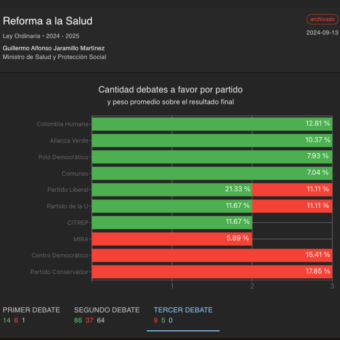

# Dato Mata Relato


<!-- TODO: [ ] Add badges for license, etc. -->

A visualization tool for legislative data, making voting records and political representation more transparent and accessible.

## 🚀 Live Demo

- [Main Site](https://votos.progres.website/)
- [GitHub Pages](https://davidfgc.github.io/dato-mata-relato)

## ✨ Features

<!-- TODO: [ ] Add key features with brief descriptions -->
- Visualization of legislative bills and voting records
- Political party analysis and representative information
- Transparent view of the legislative process stages

## 📋 Table of Contents

- [Installation](#installation)
- [Usage](#usage)
- [Architecture](#architecture)
- [Deployment](#deployment)
- [Contributing](#contributing)
- [License](#license)
- [Contact](#contact)

## 🔧 Installation

### Prerequisites

- Node.js (v16+)
- npm or yarn

### Setup

```bash
# Clone the repository
git clone https://github.com/yourusername/dato-mata-relato.git

# Navigate to project directory
cd dato-mata-relato

# Install dependencies
npm install

# Start development server
npm run dev
```

### Local Development Server
- Run the development server locally using Vite
- Access the application at: `http://localhost:5173`

## 🖥️ Usage

<!-- TODO: [ ] Add usage instructions, screenshots and examples -->

## 🏗️ Architecture

### Frontend
- React with Vite as the build tool
- UI Library: Material-UI (MUI)
- Routing: Using HashRouter from react-router-dom

### Deployment
- GitHub Pages with automated deployment via GitHub Actions

### Data Storage
- Static JSON files served from GitHub Pages

#### Data Structure
- Bills (legislative proposals)
- Political parties and their information
- Representatives and their details
- Voting records
- Voting steps (the legislative process stages)

## ⚙️ Configuration

<!-- TODO: [ ] Add configuration options and environment variables -->

## 📚 API Documentation

<!-- TODO: [ ] Document API endpoints if applicable -->

## 👥 Contributing

<!-- TODO: [ ] Add contribution guidelines -->

## 🚢 Deployment

The project is deployed to:

- GitHub Pages: https://davidfgc.github.io/dato-mata-relato
- Custom domain: https://votos.progres.website/

## 🧪 Testing

<!-- TODO: [ ] Add testing instructions -->

## 🐞 Known Issues

<!-- TODO: [ ] Document any known issues -->

## 🗺️ Roadmap

<!-- TODO: [ ] Add future development plans -->

## 📄 License

<!-- TODO: [ ] Add license information -->

## 📞 Contact

<!-- TODO: [ ] Add contact information -->

## Technical Details

### React + Vite

This project uses Vite with React for fast development. It includes:

- HMR (Hot Module Replacement)
- ESLint rules for code quality
- [@vitejs/plugin-react](https://github.com/vitejs/vite-plugin-react/blob/main/packages/plugin-react/README.md) uses [Babel](https://babeljs.io/) for Fast Refresh
- [@vitejs/plugin-react-swc](https://github.com/vitejs/vite-plugin-react-swc) uses [SWC](https://swc.rs/) for Fast Refresh

